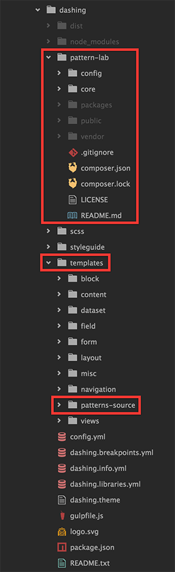
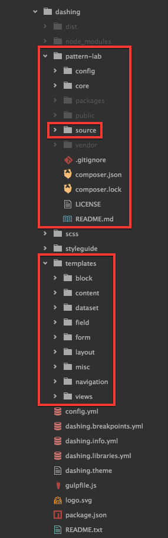
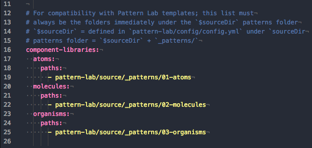
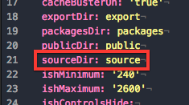
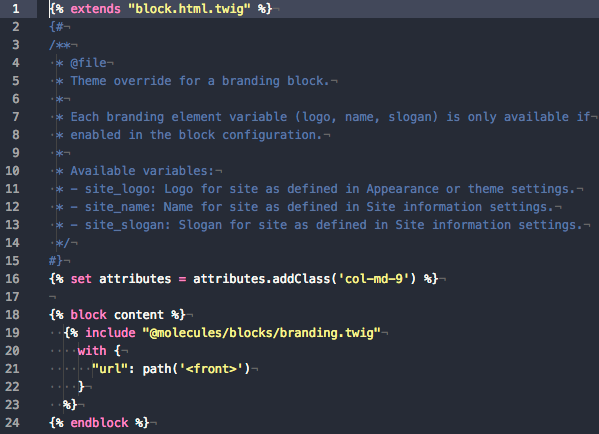
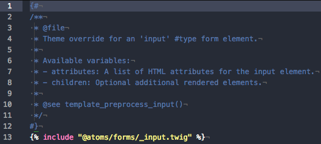
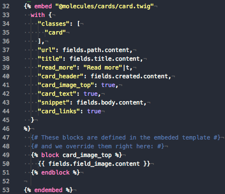

---
#Usage
---

##Structure

###PL Source

The organization of templates within your theme can be fairly flexible. Drupal 8 by default will add a namespace for themes and modules pointed at a sub-folder titled `templates`. For example, Dashing templates can be used elsewhere in Drupal by using `@dashing/sub-folder/template.html.twig`.

Here are two examples of working locations for the Pattern Lab source:

**Pattern Lab Source inside `/templates`**              | **Pattern Lab Source inside `/pattern-lab`**
------------------------------------------------------- | --------------------------------------------
 |  

This is accomplished by toggling some settings in your `<theme>.info.yml` and in Pattern Lab's `config.yml`:

**Component Library locations in `<theme>.info.yml`** | **Pattern Lab source directory in `config.yml`**
--------------------------------|---------------------------------
 | 

###Drupal 8 Components module

As mentioned above, Drupal 8 and Twig provides namespacing for theme and module templates. The [Drupal 8 Components module](https://www.drupal.org/project/components) allows you to extend that by defining your own component libraries. In the above screenshot "Component Library locations in `<theme>.info.yml`" you can see that we've defined three: `@atoms`, `@molecules`, and `@organisms`. We can now use the templates inside Pattern Lab's component architecture anywhere we want in our theme, by extending, including, or embedding them. This is a very powerful feature and it makes it very simple and straightforward to add more.

###PL Twig namespaces

Pattern Lab also provides its own Twig namespaces that overlap nicely with the above defined namespaces with the Drupal 8 Components module. Each directory under `_patterns/` is registered as a namespace. For example, `_patterns/00-atoms/` as `@atoms`. This enables cross-over from the theme & Pattern Lab to use the same syntax for Twig templates.

##Examples

Throughout the DrupalLab codebase you'll come across many examples of Twig tags, filters, and maybe not so many functions. See the previous documentation for specifics on this functionality provided by both Drupal 8 and Twig.

Here are some specific examples and use cases to refer to for `extend`, `include`, and `embed`.

###Extend

The main menu extends `menu.html.twig` and adds a custom class for styling as Bootstrap Nav Pills.

###Extend & Include

The branding block, which houses the site logo and site name, not only extends `block.html.twig` but also includes the `@molecules/blocks/branding.twig` component from Pattern Lab. Note the use of `with`, where we are allowed to provide our own value for the variable `url` because Drupal 8 provides its own content model & Pattern Lab just uses a placeholder value for prototyping purposes.

###Include

The straightforward input type form element includes `@atoms/forms/_input.twig` with no additions or alterations. This method allows simple elements to be prototyped and styled en masse in Pattern Lab and then included or extended inside the properly named template suggestions within Drupal 8.

###Include & Embed

The frontpage view in DrupalLab showcases some neat stuff, one of which is a method of reusing layout patterns created in Pattern Lab rather than needing to redefine them based on a new set of markup. The view is using unformatted rows, which Drupal 8 provides as the variable `rows`. Pattern Lab provides a layout pattern called Pyramid Grid, which keeps its variable generic with `items`. We are able to embed the Pyramid Grid pattern and use `with`, supplying our own value for `items` as `rows`. This template also includes an `h3` title pattern for row groupings, should they be supplied.

###Embed

Also within the frontage view is the actual content displayed as teasers. Pattern Lab defines a component called Card, with several variants. We embed this card in both the Page and Article teaser templates.

We can embed the same Card pattern in the newspage view which uses view fields instead of a content view mode. We then override the variables with the correct data model variables. This creates an extremely flexible, reusable pattern that can be used across the site by merely replacing what data is provided to the template to display.

